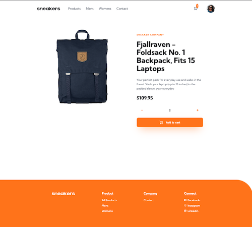
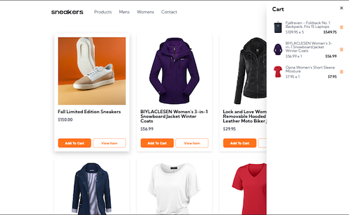

# Mini retail store - Fake Store Api

This project is a small online retail store built with React and React Router. It pulls data from the Fake Store Api and allows users to browse by category, add and remove items to their cart, and view the cart.

### Links

- Github URL: [Code here](https://github.com/brodiehunt/shopping-cart)
- Live Site URL: [Retail Store](https://brodiehunt-shopping-cart.netlify.app/)

## Table of contents

- [Installation](#installation)
- [The Goal](#the-goal)
- [Screenshot](#screenshot)
- [Built with](#built-with)

## Overview

### Installation

1. Clone this repository:

```
  https://github.com/brodiehunt/shopping-cart.git
```

2. Install the dependancies

```
  npm install
```

3. Run the application

```
  npm run dev
```

### The Goal

- Users should be able to shop for products by category.
- Users should be able to see individual page views for each product.
- Users should be able to add multiple items to their cart.
- Users should be able to interact with their cart (toggle), remove items, see subtotals and totals.
- Users should be able to contact the fake company through their contact form.

### Screenshot





### Built with

- Fake Store Api
- framer motion
- Mobile-first workflow
- [React](https://reactjs.org/) - JS library
- React router
- [Styled Components](https://styled-components.com/) - For styles
